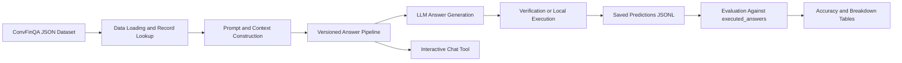

# ConvFinQA Report

# Introduction
This project aims to build a prototype that can answer conversational questions in the ConvFinQA dataset. This report describes how the solution developed over time by using recent advances in LLMs (Large Language Models). It explains the main design decisions and the changes made during development. All the code and documentation are submitted along with this report, to help on reproducing the results as well as any further discussion.

The final solution includes a Typer CLI, an interactive chat tool, data exploration tools, a methodology section, result analysis, and ideas for future work. The following sections explain the selected methods and reasoning behind them. It then discusses strengths, limitations future opportunities at the end of this report.

# Data Exploration
The provided dataset file (data/convfinqa_dataset.json) contains 3,037 `train` samples and 421 `dev` samples. The dataset focuses on conversational numerical reasoning over unstructured financial documents. It is a cleaner version of the data described in the ConvFinQA paper [1], which contains both Type I (Simple) and Type II (Hybrid) conversations. The dataset also provides a structured text table for each record. The table values have already been linearised from the original filings. This design allows the system to read table information directly from the JSON file.

Table 1 shows that the dataset contains more multi-turn conversations than single questions. Most conversations contain between two and four turns. This pattern suggests that the system must use information from previous questions and answers. For this reason, the evaluation should focus on both overall accuracy and performance at the turn level.

<div align="center">

<table>
  <tr>
    <th>Split</th><th>1 turn</th><th>2 turns</th><th>3 turns</th><th>4 turns</th><th>5 turns</th><th>6 turns</th><th>7 turns</th><th>8 turns</th><th>9 turns</th>
  </tr>
  <tr>
    <td>dev</td><td>0</td><td>116</td><td>94</td><td>103</td><td>88</td><td>17</td><td>2</td><td>1</td><td>0</td>
  </tr>
  <tr>
    <td>train</td><td>6</td><td>742</td><td>657</td><td>837</td><td>561</td><td>167</td><td>50</td><td>15</td><td>2</td>
  </tr>
</table>

<p><strong>Table 1. Dialogue length distribution across train and dev.</strong></p>

</div>

The types of gold program in the data shows the numerical reasoning is built from a small set of arithmetic operations. Together, as what Table 2 shows, subtraction and division account for more than 70% of the total, which matches the nature of many financial questions: computing differences, ratios, margins, and percentage changes.

<div align="center">

<table>
  <tr>
    <th style="text-align:center;">Operation</th>
    <th style="text-align:center;">Count</th>
    <th style="text-align:center;">% of operation calls</th>
  </tr>
  <tr>
    <td>subtract</td>
    <td style="text-align:right;">5,131</td>
    <td style="text-align:right;">40.07%</td>
  </tr>
  <tr>
    <td>divide</td>
    <td style="text-align:right;">4,280</td>
    <td style="text-align:right;">33.42%</td>
  </tr>
  <tr>
    <td>add</td>
    <td style="text-align:right;">2,457</td>
    <td style="text-align:right;">19.19%</td>
  </tr>
  <tr>
    <td>multiply</td>
    <td style="text-align:right;">894</td>
    <td style="text-align:right;">6.98%</td>
  </tr>
  <tr>
    <td>greater</td>
    <td style="text-align:right;">40</td>
    <td style="text-align:right;">0.31%</td>
  </tr>
  <tr>
    <td>exp</td>
    <td style="text-align:right;">4</td>
    <td style="text-align:right;">0.03%</td>
  </tr>
</table>

<p><strong>Table 2. Gold program operation distribution across train and dev.</strong></p>

</div>

As shown in the ConvFinQA paper, Table 3 summarises the main challenges that make ConvFinQA more difficult than simple questions answering. The main task requires the solutions to generate answers using the correct evidence, resolve conversational references across multiple turns, and perform accurate reasoning over many competing values [1]. These challenges motivate the version evolution: each version targets a different source of error, from evidence selection, pattern retrieval verification, and deterministic calculation execution.

<div align="center">

<table>
  <tr>
  </tr>
  <tr>
    <td>1. Many competing numeric candidates within each record</td>
  </tr>
  <tr>
    <td>2. Grounding the answer to the correct evidence or table row</td>
  </tr>
  <tr>
    <td>3. Selecting the correct value from nearby or similar candidates</td>
  </tr>
  <tr>
    <td>4. Resolving multi-turn references and follow-up questions</td>
  </tr>
  <tr>
    <td>5. Preventing later-turn error propagation</td>
  </tr>
  <tr>
    <td>6. Producing clean and parseable final answers</td>
  </tr>
  <tr>
    <td>7. Handling ratio and percentage scale consistently</td>
  </tr>
  <tr>
    <td>8. Choosing the correct operation, sign, and denominator</td>
  </tr>
  <tr>
    <td>9. Avoiding arithmetic mistakes in numerical reasoning</td>
  </tr>
  <tr>
    <td>10. Inferring the intended reasoning pattern for program-style questions</td>
  </tr>
</table>

<p><strong>Table 3. Key modeling challenges in ConvFinQA paper.</strong></p>

</div>

Our solution reads the provided ConvFinQA dataset from the given JSON file, where each record already contains pre-extracted document text, a structured table, dialogue questions, gold answers, and metadata. The structured table object is converted into a readable row-oriented table or evidence snippets with IDs (see more details in Section Methodology), which are used by different versions of our solution. Model outputs and evaluation results are save as JSONL file: batch runs write one prediction per turn, and the evaluation step later reads those saved predictions, compares them against `executed_answers`, and writes scored results back to JSONL. This separation makes the pipeline reproducible because the result generation and scoring can be rerun independently. 

In addition, a basic data leakage check was performed to understand how independent the `train` and `dev` splits are. We used LLM and tt founds that no exact same records are shared by both `train` and `dev`, but the data naturally contains repeated questions and similar reasoning patterns across different cases. Within each split, the `record_id` is unique, but there are some records were derived from the same source PDF. As mentioned in the paper [1], this is expected in ConvFinQA because different conversations may come from the same financial page.

# Methodology

## Method Boundaries And Scoring Design
Based on the dataset and the scope of the task, this solution does not use a full corpus-level RAG (Retrieval-Augmented Generation) framework. The assignment already provides the correct `record_id` for each conversation. As a result, the key challenge is not document retrieval but answering the question correctly within the selected record. A full RAG pipeline would require document indexing, chunk retrieval, vector search, and re-ranking. These components would increase engineering complexity and computational cost. However, they would not directly address the main challenges identified in this assignment, as shown in Table 3.

The evaluation uses `executed_answers` instead of `turn_program`. The goal of this project is to answer financial questions correctly rather than reproducing the exact ConvFinQA annotations. In addition, `turn_program` represents only one possible reasoning path. Different reasoning processes can still lead to the same correct result. This situation is common in LLM-based systems. So we use `executed_answers` for strict scoring, and the solution generates information similar to `turn_program` which is used to make the reasoning inspectable and to execute the final arithmetic deterministically. The solution also has a numeric comparison function that considers decimal tolerance. This is an important function because 0.2085, 0.209 and 20.9% are actually same thing.

The development process used a fixed sample of 500 records from the `train` dataset. The gold answers were hidden during testing, and the solution model had to generate the answers independently. This approach was necessary because evaluating multiple solution versions on the full `train` dataset would require significantly more LLM API calls, cost and runtime. The sample was selected using a fixed random seed which improves reproducibility. The sample size was also large enough to reveal the most common failure cases. The final evaluation uses the complete `dev` dataset which remains separate from development data. This separation provides a fair held-out comparison.

The solution is also integrated into the interactive chat tool (see README.md for more details). This integration allows users to test different versions through direct interaction and not only through batch evaluation. Users can provide a `record_id` and a version number. The system then returns the answer generated by the selected version. It is especially useful for users to compare later versions with earlier versions and to understand how verification or calculation issues are fixed.

## Iterative Solution Evolution
A single large solution can make it difficult to identify which component causes an improvement or a regression. Therefore, the solution was developed through a series of controlled iterations. One main capability is introduced into each version which can then be compared directly with the previous version. This approach makes the development process more transparent and presents decision making process of the design clearer.

The first version `v1` uses the selected `record_id` and constructs the complete record context. The context includes `pre_text`, `post_text`, table content, conversation history, and the current question. The system passes this context to the model together with the conversation history. This `v1` provides a reference point that later version could add corresponding functions that target the wrong evidence selection, incorrect value selection, arithmetic mistakes, messy final answers and multi-turn error propagation. Table 4 shows the results of running `v1` using the `train` sample. The challenges shown in the paper [1] can be grouped into a smaller set of observed error types (a LLM-assisted error analysis) which made the development priority clearer:

<table>
  <thead>
    <tr align="center">
      <th>Error type</th>
      <th>Count</th>
      <th>Related modeling challenges (shown in Table 3)</th>
      <th>Development direction</th>
    </tr>
  </thead>
  <tbody>
    <tr>
      <td>Calculation / program errors</td>
      <td>309</td>
      <td>Choosing the correct operation, sign, denominator; avoiding arithmetic mistakes; inferring reasoning pattern</td>
      <td>Add verification, reasoning-pattern guidance, and later structured execution</td>
    </tr>
    <tr>
      <td>Ratio or percentage errors</td>
      <td>231</td>
      <td>Handling ratio/percentage scale; choosing denominator; preventing arithmetic/format mismatch</td>
      <td>Add percent/ratio normalization and denominator checks</td>
    </tr>
    <tr>
      <td>Number-selection errors</td>
      <td>110</td>
      <td>Competing numeric candidates; grounding to the correct evidence/table row; selecting the correct nearby value</td>
      <td>Add record-local evidence selection</td>
    </tr>
    <tr>
      <td>Non-numeric / refusal errors</td>
      <td>65</td>
      <td>Producing clean parseable answers; avoiding unsupported refusals when numeric evidence exists</td>
      <td>Add no-gold retry rules for refusal and final-answer format</td>
    </tr>
    <tr>
      <td>Other / annotation ambiguity</td>
      <td>2</td>
      <td>Dataset/task-format mismatch</td>
      <td>Document as limitation rather than overfit</td>
    </tr>
  </tbody>
</table>

<div align="center">
<p><strong>Table 4. Key modeling challenges and error type mapping.</strong></p>
</div>

<br>

This analysis suggests two things: First, the largest source of error was Calculation / program errors , not only document retrieval. Second, grounding still had to come first because calculation cannot be correct if the wrong row or value is selected. Therefore the development order starts with a baseline, adds evidence grounding, verification/retry, then add reasoning-pattern retrieval, finally the deterministic execution of structured plans. Please see Section "1. Prompt Evolution" and "2. Version Comparison With Example" in Appendix for more details of implementation evolution between different versions. Table 5 shows the exact definition of each version, along with the corresponding main targets. One assumption here is the LLM-generated values and operations are mostly reasonable, for example, the evidence reranking and calculation plan generation etc. 

<table>
  <thead>
    <tr align="center">
      <th>Version</th>
      <th>Main idea</th>
      <th>Error target</th>
      <th>Why it was introduced</th>
      <th>LLM role</th>
    </tr>
  </thead>
  <tbody>
    <tr>
      <td><code>v1</code></td>
      <td>Full-record baseline</td>
      <td>Baseline capability</td>
      <td>Whether a modern LLM can answer from the full selected record plus conversation history.</td>
      <td>Reads the full selected record, resolves the current turn, and produces the final answer.</td>
    </tr>
    <tr>
      <td><code>v2</code></td>
      <td>Record-local evidence selection</td>
      <td>Number-selection errors</td>
      <td>v2 highlights relevant text/table snippets before answering.</td>
      <td>Reranks candidate snippets, then uses focused evidence plus the full record to answer questions.</td>
    </tr>
    <tr>
      <td><code>v3</code></td>
      <td>Evidence selection + verification retry</td>
      <td>Non-numeric/refusal errors; ratio or percentage errors; simple calculation/program errors</td>
      <td>v3 does a retry when local consistency checks detects likely failure.</td>
      <td>Produces an initial answer, then revises once if the verifier flags a local inconsistency.</td>
    </tr>
    <tr>
      <td><code>v4</code></td>
      <td>v3 + few-shot reasoning retrieval</td>
      <td>Calculation/program errors, especially reasoning-pattern uncertainty</td>
      <td>v4 retrieves similar solved train examples as operation-pattern hints, without using their numbers as evidence.</td>
      <td>Uses similar solved examples as reasoning-pattern hints to answer the question given current value.</td>
    </tr>
    <tr>
      <td><code>v5</code></td>
      <td>v3 + structured calculation-plan execution</td>
      <td>Calculation/program errors and ratio or percentage errors</td>
      <td>v4 improved accuracy but added example noise and retrieval complexity. v5 uses an auditable plan and execute the arithmetic locally.</td>
      <td>Extracts named values and proposes a calculation plan and uses local code executes the arithmetic.</td>
    </tr>
  </tbody>
</table>
<div align="center">
<p><strong>Table 5. Solution evolution plan and the role of LLM.</strong></p>
</div>

<br>

As Table 6 shows, the general accuracy in each breakdown metric (same as the metrics being used in the paper [1]) shows a positive growth trend from `v1` to `v5`. The overall accuracy rises from 66.9% to around 72%, meaning a clear benefit gain on program questions and later coversation turns.

<div align="center">
<table>
  <thead>
    <tr align="center">
      <th>Breakdown</th>
      <th>v1</th>
      <th>v2</th>
      <th>v3</th>
      <th>v4</th>
      <th>v5</th>
    </tr>
  </thead>
  <tbody>
    <tr><td>Full results</td><td>1223/1827 (66.9%)</td><td>1231/1827 (67.4%)</td><td>1275/1827 (69.8%)</td><td>1323/1827 (72.4%)</td><td>1316/1827 (72.0%)</td></tr>
    <tr><td>Number selection questions</td><td>505/640 (78.9%)</td><td>514/640 (80.3%)</td><td>522/640 (81.6%)</td><td>537/640 (83.9%)</td><td>514/640 (80.3%)</td></tr>
    <tr><td>Program questions</td><td>718/1187 (60.5%)</td><td>717/1187 (60.4%)</td><td>753/1187 (63.4%)</td><td>786/1187 (66.2%)</td><td>802/1187 (67.6%)</td></tr>
    <tr><td>Simple conversations</td><td>782/1163 (67.2%)</td><td>798/1163 (68.6%)</td><td>819/1163 (70.4%)</td><td>862/1163 (74.1%)</td><td>858/1163 (73.8%)</td></tr>
    <tr><td>Hybrid conversations</td><td>441/664 (66.4%)</td><td>433/664 (65.2%)</td><td>456/664 (68.7%)</td><td>461/664 (69.4%)</td><td>458/664 (69.0%)</td></tr>
    <tr><td>Hybrid first part</td><td>258/363 (71.1%)</td><td>248/363 (68.3%)</td><td>271/363 (74.7%)</td><td>280/363 (77.1%)</td><td>271/363 (74.7%)</td></tr>
    <tr><td>Hybrid second part</td><td>183/301 (60.8%)</td><td>185/301 (61.5%)</td><td>185/301 (61.5%)</td><td>181/301 (60.1%)</td><td>187/301 (62.1%)</td></tr>
    <tr><td>Turn 0</td><td>385/500 (77.0%)</td><td>389/500 (77.8%)</td><td>392/500 (78.4%)</td><td>403/500 (80.6%)</td><td>390/500 (78.0%)</td></tr>
    <tr><td>Turn 1</td><td>349/500 (69.8%)</td><td>348/500 (69.6%)</td><td>358/500 (71.6%)</td><td>377/500 (75.4%)</td><td>374/500 (74.8%)</td></tr>
    <tr><td>Turn 2</td><td>238/376 (63.3%)</td><td>240/376 (63.8%)</td><td>250/376 (66.5%)</td><td>261/376 (69.4%)</td><td>263/376 (69.9%)</td></tr>
    <tr><td>Turn 3</td><td>153/266 (57.5%)</td><td>146/266 (54.9%)</td><td>165/266 (62.0%)</td><td>174/266 (65.4%)</td><td>178/266 (66.9%)</td></tr>
    <tr><td>Turn 4</td><td>67/132 (50.8%)</td><td>70/132 (53.0%)</td><td>76/132 (57.6%)</td><td>73/132 (55.3%)</td><td>78/132 (59.1%)</td></tr>
    <tr><td>Turn 5</td><td>20/36 (55.6%)</td><td>25/36 (69.4%)</td><td>23/36 (63.9%)</td><td>24/36 (66.7%)</td><td>21/36 (58.3%)</td></tr>
    <tr><td>Turn 6</td><td>8/12 (66.7%)</td><td>9/12 (75.0%)</td><td>8/12 (66.7%)</td><td>8/12 (66.7%)</td><td>8/12 (66.7%)</td></tr>
    <tr><td>Turn 7</td><td>3/4 (75.0%)</td><td>4/4 (100.0%)</td><td>3/4 (75.0%)</td><td>3/4 (75.0%)</td><td>4/4 (100.0%)</td></tr>
    <tr><td>Turn 8</td><td>0/1 (0.0%)</td><td>0/1 (0.0%)</td><td>0/1 (0.0%)</td><td>0/1 (0.0%)</td><td>0/1 (0.0%)</td></tr>
  </tbody>
</table>

<p><strong>Table 6. Accuracy results breakdown using train sample.</strong></p>
</div>

<br>

One interesting case (shown as in Table 7) is the only "Turn 8" question (Record ID: Double_AMT/2012/page_121.pdf) presents in the `train` data sample. No version answered all questions correctly because the turn depends on long multi-tun state, ambiguous wordings (e.g., "represent in relation to") as well as ratio-scale handling. This case is a good example that highlights the remaining limitations of the text-based conversation history and prompts, and motivates a structured state based memory, as for future work.

<div align="center">
<table>
  <thead>
    <tr align="center">
      <th>Turn</th>
      <th>Question focus</th>
      <th>Gold</th>
      <th>v1</th>
      <th>v2</th>
      <th>v3</th>
      <th>v4</th>
      <th>v5</th>
    </tr>
  </thead>
  <tbody>
    <tr><td>0</td><td>total acquired customer-related and network location intangibles</td><td>147.7</td><td>Wrong</td><td>Correct</td><td>Correct</td><td>Correct</td><td>Correct</td></tr>
    <tr><td>1</td><td>expected amortization period</td><td>20.0</td><td>Correct</td><td>Correct</td><td>Correct</td><td>Correct</td><td>Correct</td></tr>
    <tr><td>2</td><td>expected annual amortization expenses</td><td>7.385</td><td>Wrong</td><td>Correct</td><td>Correct</td><td>Correct</td><td>Correct</td></tr>
    <tr><td>3</td><td>value of current assets</td><td>11095.0</td><td>Wrong</td><td>Wrong</td><td>Wrong</td><td>Wrong</td><td>Wrong</td></tr>
    <tr><td>4</td><td>total sum of current assets and non-current ones</td><td>37806.0</td><td>Wrong</td><td>Wrong</td><td>Wrong</td><td>Wrong</td><td>Wrong</td></tr>
    <tr><td>5</td><td>including property and equipment, what becomes that sum</td><td>21079.0</td><td>Wrong</td><td>Wrong</td><td>Wrong</td><td>Wrong</td><td>Wrong</td></tr>
    <tr><td>6</td><td>including intangible assets, what becomes this total</td><td>58885.0</td><td>Wrong</td><td>Wrong</td><td>Correct</td><td>Wrong</td><td>Wrong</td></tr>
    <tr><td>7</td><td>fair value of net assets acquired</td><td>57536.0</td><td>Wrong</td><td>Correct</td><td>Correct</td><td>Wrong</td><td>Correct</td></tr>
    <tr><td>8</td><td>how much does that total represent in relation to this fair value</td><td>1.02345</td><td>Wrong</td><td>Wrong</td><td>Wrong</td><td>Wrong</td><td>Wrong</td></tr>
  </tbody>
</table>
<p><strong>Table 7. Answers for the record with 8 turns.</strong></p>

</div>

## Evaluate Discussion And Solution Limitations

The dev results (shown as in Table 8) follows the same general trend as the train-500 sample in Table 6. The biggest gains are on program questions and later turn cases, which require arithmetic, operation selection, and conversation context. We can see `v5` performed stronger on program questions and the second part of the hybrid conversations. This supports the value of explicit calculation plans for the multi-step reasoning cases. It does not mean reimplementing the same system as the paper, but building a lighter, more auditable JSON plan designed for this prototype. 

<div align="center">
<table>
  <thead>
    <tr align="center">
      <th>Breakdown</th>
      <th>v1</th>
      <th>v2</th>
      <th>v3</th>
      <th>v4</th>
      <th>v5</th>
    </tr>
  </thead>
  <tbody>
    <tr><td>Full results</td><td>987/1490 (66.2%)</td><td>1022/1490 (68.6%)</td><td>1052/1490 (70.6%)</td><td>1070/1490 (71.8%)</td><td>1066/1490 (71.5%)</td></tr>
    <tr><td>Number selection questions</td><td>377/487 (77.4%)</td><td>395/487 (81.1%)</td><td>400/487 (82.1%)</td><td>394/487 (80.9%)</td><td>378/487 (77.6%)</td></tr>
    <tr><td>Program questions</td><td>610/1003 (60.8%)</td><td>627/1003 (62.5%)</td><td>652/1003 (65.0%)</td><td>676/1003 (67.4%)</td><td>688/1003 (68.6%)</td></tr>
    <tr><td>Simple conversations</td><td>724/1052 (68.8%)</td><td>754/1052 (71.7%)</td><td>768/1052 (73.0%)</td><td>787/1052 (74.8%)</td><td>779/1052 (74.0%)</td></tr>
    <tr><td>Hybrid conversations</td><td>263/438 (60.0%)</td><td>268/438 (61.2%)</td><td>284/438 (64.8%)</td><td>283/438 (64.6%)</td><td>287/438 (65.5%)</td></tr>
    <tr><td>Hybrid first part</td><td>154/250 (61.6%)</td><td>154/250 (61.6%)</td><td>162/250 (64.8%)</td><td>159/250 (63.6%)</td><td>154/250 (61.6%)</td></tr>
    <tr><td>Hybrid second part</td><td>109/188 (58.0%)</td><td>114/188 (60.6%)</td><td>122/188 (64.9%)</td><td>124/188 (66.0%)</td><td>133/188 (70.7%)</td></tr>
    <tr><td>Turn 0</td><td>306/421 (72.7%)</td><td>314/421 (74.6%)</td><td>314/421 (74.6%)</td><td>322/421 (76.5%)</td><td>312/421 (74.1%)</td></tr>
    <tr><td>Turn 1</td><td>294/421 (69.8%)</td><td>300/421 (71.3%)</td><td>309/421 (73.4%)</td><td>313/421 (74.3%)</td><td>313/421 (74.3%)</td></tr>
    <tr><td>Turn 2</td><td>192/305 (63.0%)</td><td>196/305 (64.3%)</td><td>206/305 (67.5%)</td><td>208/305 (68.2%)</td><td>208/305 (68.2%)</td></tr>
    <tr><td>Turn 3</td><td>127/211 (60.2%)</td><td>138/211 (65.4%)</td><td>143/211 (67.8%)</td><td>149/211 (70.6%)</td><td>151/211 (71.6%)</td></tr>
    <tr><td>Turn 4</td><td>56/108 (51.9%)</td><td>63/108 (58.3%)</td><td>65/108 (60.2%)</td><td>63/108 (58.3%)</td><td>66/108 (61.1%)</td></tr>
    <tr><td>Turn 5</td><td>11/20 (55.0%)</td><td>10/20 (50.0%)</td><td>13/20 (65.0%)</td><td>13/20 (65.0%)</td><td>14/20 (70.0%)</td></tr>
    <tr><td>Turn 6</td><td>1/3 (33.3%)</td><td>1/3 (33.3%)</td><td>2/3 (66.7%)</td><td>2/3 (66.7%)</td><td>2/3 (66.7%)</td></tr>
    <tr><td>Turn 7</td><td>0/1 (0.0%)</td><td>0/1 (0.0%)</td><td>0/1 (0.0%)</td><td>0/1 (0.0%)</td><td>0/1 (0.0%)</td></tr>
  </tbody>
</table>
<p><strong>Table 8. Accuracy results breakdown using dev data.</strong></p>
</div>

<br>

In addition to batch evaluation on gold ConvFinQA turns, the interactive chat tool was used for qualitative smoke testing with user-defined questions (not included in the original `train` or `dev` data) over selected records. Due to time limit, only a small number of such questions were tested. The results were broadly consistent with the dev results, showing the later versions performed better. However, all versions struggled to answer highly vague user-defined questions, especially the question did not clearly specify the time period, target values or has long turns.

The remaining limitations of this prototype work are clear. First, as mentioned in previous sections, some operations (e.g., value extraction) is still partly driven by LLM. This means if the LLM model selects the wrong value, the local execuition will compute the next answer with the wrong input. Similarly, the compute operations are also driven by LLM. Even the executor prevents arithmetic mistakes, but it cannot always know whether the intended operation should be subtraction, division, or a percentage conversion. Third, the table-cell grounding is working but not fully structured. The solution does not build a formal table graph, which could increase the chance of selecting the wrong number. Next, the multi-turn state is passed as text history rather than stored as named structured variables. This still could make the long reference chains such as "that total" can still fail. Finally, the verification is still heuristic rather than a real financial-reasoning verifier, so it only catches common failures but does not guarantee the correctness.

# System Design And Tooling

This prototype has an command-line driven pipeline works for both the interactive chat and batch processing. As shown in the high-level architecture diagram below, it starts with the data loader, formats and constructs the prompt, runs the user selected version (`v1` to `v5`), saves the raw output to JSONL, and evaluates the answers separately against `executed_answers`. The gpt-4o-mini [2] is used as the main LLM model because of cost and runtime limitations. A parallelisation function is built for running the batch processing, while preserving sequential turn order inside each conversation. The same pipeline also connects to the interactive chat tool, and user can run the selected version to see the answer for a given question. See more details in the README.md.



The pipeline also includes an experimental v5a variant, which keeps v5 unchanged but adds a limited offline numeric fallback. This fallback is intended as a robustness layer when the LLM API call is unavailable. It generates simple numeric candidates using the selected evidence, scores them using keyword overlap, evidence rank, and domain heuristics. Then it converts the top candidate scores into a softmax-style confidence. The final answer is presented with a confidence score, as for the result inspection purpose. This lightweight fallback is only for showing how confidence-aware fallback behaviour could be added when the LLM call is unavailable.

# Future Work

The most natural future extension is structured conversation-state memory as an extension of `v5`. Given `v5` already produces named values, evidence IDs, and calculation steps, thus a good future version could save these outputs as structured state. For example, saving table-cell grounding as a structured object. Later follow-up questions could then reuse explicit variables rather than natural-language history. So if there is more time, the next version will target on improvements of ambiguous multi-turn state tracking, while still avoiding a paper-like full pipeline rebuild and keeping the system lightweight and inspectable.

A future Bayesian-inspired extension could follow the paper’s formulation [1] more directly:
```text
P(A | T, B, Qn) = Σ_i P(G_i | T, B, Q0, Q1, ..., Qn−1)
```
where each G_i is a candidate reasoning program that can produce answer A. So instead of trusting one generated plan, the system could calculate a score Score(G) using evidence match, operation fit, unit consistency etc, and calculate the posterior probability:
```text
P(G | context) = exp(score(G)) / sum over all candidates exp(score(candidate))
```
Then select the candidate program with highest posterior probability to answer the question. However, this may needs significant amount of work and likely hard to be verified and tested. 

Lastly, in a real-world setting, an agent-based architecture could become useful once the task expands beyond the provided ConvFinQA setup. This prototype uses data that has relevant `record_id` and extracted table/text, which could not be available in reality. A well designed but constrained Agent system could use different tools to orchestrate the whole process. However, it is out of the scope of this work and this idea is more suitable for real-world financial QA.

# AI Usage Declaration

AI tools were used during this work as an implementation assistant. Codex [3] was used to help to draft and edit Python modules, generate unit tests, run evaluation commands, format Markdown tables, create README file, and summarize experimental results. The methodology, version design, interpretation of results, project scope, and final submitted report were directed and created by the author.

# Reference
[1] Chen, Zhiyu, Shiyang Li, Charese Smiley, Zhiqiang Ma, Sameena Shah, and William Yang Wang. "Convfinqa: Exploring the chain of numerical reasoning in conversational finance question answering." In Proceedings of the 2022 conference on empirical methods in natural language processing, pp. 6279-6292. 2022.

[2] OpenAI. (2024, July 18). GPT-4o mini: Advancing cost-efficient intelligence. https://openai.com/index/gpt-4o-mini-advancing-cost-efficient-intelligence/

[3] OpenAI. (n.d.). Codex in ChatGPT. https://openai.com/codex/

<br>

# Appendix
## 1. Prompt Evolution
All versions use the same core system prompt, which is `Target / Values / Operation` value check, and finish with `Final answer: <value>`. The differences between versions come from extra prompt sections or extra pipeline steps.

| Version | System / prompt difference |
| --- | --- |
| `v1` | Uses the base prompt and the full selected record only. The `Relevant evidence` section is empty. |
| `v2` | Uses the same base prompt, plus the `Relevant evidence` section with selected record-local snippets. |
| `v3` | Uses the same prompt as `v2`, but adds a correction retry message if a suspicious answer is detected. |
| `v4` | Uses the `v3` prompt, and retrieves some solved train examples as reasoning-pattern hints. |
| `v5` | Uses the `v3` prompt, but adds a structured `Calculation plan` JSON instruction. |

More detailed prompt difference between different versions:

**v1 base prompt**

```text
Answer the user's questions using only the selected ConvFinQA record below. Use the conversation history when it is relevant to the current question. Before giving the final answer, write a lightweight value check with these lines:
Target:
Values:
Operation:
Then write Final answer: <value>.
```

**v2 added evidence section**

```text
Relevant evidence:
...
...
```

**v3 added retry message when verification fails**

```text
Your previous answer may have a calculation or formatting issue. Please revise the answer for the same question using the same record. If the selected evidence contains a plausible numeric candidate, do not change the answer into a refusal.
```

**v4 added few-shot reasoning examples**

```text
Use similar solved train examples only to understand the reasoning pattern. Do not copy their numbers; the current answer must come from the selected record.
Similar solved examples:
...
```

**v5 added structured calculation-plan instruction**

```text
For this version, also output a machine-readable Calculation plan JSON block before the final answer. Allowed ops are select, add, subtract, multiply, divide, negate, abs, max, and min. The code will execute this JSON locally.
```

## 2. Version Comparison With Example

### v1 -> v2: Better Evidence Selection
```text
Record ID: Single_PNC/2018/page_81.pdf-3
Turn index: 0
Question: What was the value of liquid assets?
Gold executed answer: 22.1
```

In this example, apart from the full-record (as `v1`), `v2` also add an evidence block in the prompt:
```text
Relevant evidence:
At December 31, 2018, our liquid assets consisted of short-term investments
totaling $22.1 billion and securities available for sale totaling $63.4 billion.
```

The result shows `v1` combined two nearby numbers and answered 85.5 (22.1+63.4), while `v2` correctly shows 22.1 as the final answer.


### v2 -> v3: Verification Catches Suspicious Selection

```text
Record ID: Double_ETR/2016/page_424.pdf
Turn index: 0
Question: As of December 31, 2016, what was the drawn amount from the credit facility that was set to expire in August 2021?
Gold executed answer: 4.7
```

The selected evidence contains two nearby candidates:

```text
cash borrowings = 0
letters of credit outstanding = 4.7
```

In this case, `v2` selected the wrong evidence and produced a wrong answer 0, and `v3` selected the correct evidence and returned 4.7.

### v3 -> v4: Reasoning Examples Help Program-Style Questions

```text
Record ID: Single_UPS/2017/page_111.pdf-4
Question sequence:
- vehicles under capital lease in 2017
- same value in 2016
- yearly change
- percentage change
```

The table in raw data is embedded after a long pre_text about floating-rate notes and capital lease obligations. The question says “vehicles under capital lease”, but the table label is just vehicles under the section “property, plant and equipment subject to capital leases”. `v3` failed to connect the section title with the table row, and returned "not enough information". For this case, `v4` retrieved similar solved turns with the similar pattern: select two year-specific values, subtract them, then divide the change by the earlier value for a percentage question. So `v4` returned the correct value: selected `70` and `68`, computed `70 - 68 = 2`, then `2 / 68 = 2.9%`.

### v4 -> v5: Explicit Calculation Plans Helps Local Execution

```text
Record ID: Single_EMR/2017/page_53.pdf-2
Turn index: 2
Question: What is the value of long term debt in 2016 divided by the value of total debt?
Gold executed answer: 0.61379
```
In this example, `v4` used 4051/6.6 = 613.79 as the final answer, which has the denominator in a wrong scale, i.e., the 6.6 means $6.6 billion, but 4051 is in million. In contrast, `v5` used a structured calculation plan which stored the two numbers in the same scale, which helped the model get the correct answer 4051/6600 = 0.61379.

`v5` plan structure:

```json
{
  "values": [
    {"id": "long_term_debt_2016", "value": 4051, "evidence": "..."},
    {"id": "total_debt_2016", "value": 6600, "evidence": "..."}
  ],
  "steps": [
    {"id": "answer", "op": "divide", "args": ["long_term_debt_2016", "total_debt_2016"]}
  ],
  "answer": "answer"
}
```
